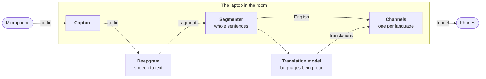
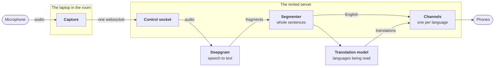

# Transept

Live subtitling and translation for church meetings, delivered to phones.

Someone speaks into a microphone.
A few tenths of a second later the words appear on the phones of people who cannot hear well.
A second or two after that, the same sentence appears in French, Swahili, or whatever other languages anyone in the room has open.

Nothing is projected on a screen and readers install nothing.
Each person opens a link and chooses their own language and their own text size.

## Getting started

Transept runs in one of two modes, and the difference is which machine does the work.

**Self-hosted** is the default, and the one to start with.
A laptop in the room captures the audio, talks to the speech and translation services itself, serves the subtitles to phones, and needs nothing rented and nobody else involved.
**To install and configure it, see [SETUP.md](SETUP.md).**
That file walks through the whole process, from installing Python to handing out the first QR code, and assumes no programming experience.

**Third-party hosted** moves recognition and translation onto a small server somewhere else, leaving the laptop in the room to capture audio and nothing more.
It is the answer when the building's network cannot carry a meeting, and it lets several rooms share one address and one set of keys.
A room set up this way holds no API keys at all, only its own name and one token.
[HOSTED.md](HOSTED.md) explains why and what changes, and [`deploy/`](deploy/README.md) is the server itself, room by room.

## How it works

Both modes run the same pipeline, over the same code, and differ only in where each stage runs.

Audio goes from the sound card to [Deepgram](https://deepgram.com/) (Speech-to-text API) over a websocket, as Opus where `ffmpeg` is installed and as raw audio where it is not, which is about an eighth of the bandwidth for no difference the recognizer can hear.
Deepgram returns finalized fragments, which often cut sentences in half, so a segmenter buffers them into whole sentences.
The segmenter closes a sentence when the recognizer reports an endpoint, when the text ends in terminal punctuation, when a silent gap opens, or when the ceiling expires.
Whole sentences matter more than they sound like they should: translating "on the heater" by itself may produce nonsense in other languages.

Whole sentences go to the translation model, all languages in one call, running concurrently but published in source order.
English publishes immediately, and translations arrive on their own channels a moment later.
Phones subscribe over server-sent events, one channel per language, with the last sixty lines replayed on connect so somebody arriving late has context.

Recognition runs continuously while a session is on, but a language is translated only while somebody is reading that language, so a language nobody opens costs nothing.

Either way there are two addresses, each carrying a token of its own.
The operator opens one on the laptop to pick a microphone and press Start, and that page is always bound to the laptop alone, so the controls cannot be reached from the network or through a tunnel.
Everyone else opens the other on their phone, which is the address behind the QR code.

### Self-hosted

One laptop runs all of it, as `server.py`, holding both API keys and serving both addresses on two ports of its own.
A tunnel in front publishes the reader port, because phones need HTTPS and the address the laptop binds is not an address a phone can reach, and the `./transept` script opens and closes that tunnel alongside the server.

### Third-party hosted

The laptop runs `sender.py`, which captures audio and pushes it up one websocket, and the rented server runs the same `server.py` with that socket in place of a sound card.
The room's uplink then carries audio and nothing else, instead of carrying every subtitle out of the building and back down to a phone a few meters away, and a phone on cellular stops depending on the building's network at all.
The operator page is unchanged and still on loopback, forwarding Start, Stop, and the language switches over the same socket.

The keys live on the server, so setting up a room's laptop involves no Deepgram account.
One server holds several rooms, one process each, under one hostname: `https://transept.example.org/chapel/reader`.

## The code

**Source files:** `server.py` is the web server and session manager, and the whole of a self-hosted Sunday, whether run directly or through the `transept.py` script that also opens the tunnel.
`pipeline.py` is the same pipeline without the web layer, which is the fastest way to check a microphone or tune segmentation.
`review.py` translates a text file offline, `record.py` keeps a session and turns it into a review document, `capture.py` is the audio layer, `selftest.py` checks the software without a microphone or an API key, and `static/` holds the two web pages.
`controls.py` holds the operator page and its routes, which both entry points serve, and `sender.py` is the room's half of a hosted deployment, alongside the server configuration in `deploy/`.

**Config file:** Every setting is in `config.toml`, keys included, so switching translation providers is one edit rather than two.
The file is gitignored, because the file holds your keys once you fill them in.
A fork that wants to commit its settings so a second room starts from a known-good file should take the keys back out first, or set the keys through the environment instead.

## What you need

Transept was built for a Sunday school class with hard-of-hearing members and members whose first language is not English, but nothing in the software is specific to that setting.
Running Transept takes a sound system, a laptop, and somebody willing to press a button before the meeting starts.

- A computer running Linux, macOS, or Windows, with Python 3.11 or newer.
  No GPU required, because the heavy work happens in the cloud.
- An audio input, ideally a line out from the sound board.
  Recognition quality is decided almost entirely here, and a laptop microphone on a table is far worse than a board feed.
- A key from [console.deepgram.com](https://console.deepgram.com) for speech recognition.
- A key for any provider with an OpenAI-compatible endpoint for translation.
  [Google AI Studio](https://aistudio.google.com/), [Claude Platform](https://platform.claude.com/), [OpenAI Platform](https://platform.openai.com/), a [LiteLLM](https://www.litellm.ai/) proxy, and a local [Ollama](https://ollama.com/) install all work.
- A way for phones to reach the laptop over HTTPS, which in practice means a tunnel.
  [Tailscale Funnel](https://tailscale.com/) needs no domain and costs nothing, and is what [SETUP.md](SETUP.md) uses.

Capture goes through PortAudio by way of the `sounddevice` package, so the laptop already plugged into the chapel sound system for Zoom should generally work as is.
A second backend, `parec`, is available on Linux and is used by default there.

A third-party hosted room needs the first two bullets and none of the rest: the keys and the public address belong to the server, and the laptop needs only the room's name and its control token.

**What it costs (Sep 2026):** Speech recognition runs about $0.50 per hour through Deepgram, and new accounts include $200 of free credit that covers a great deal of use.
Translation through a small fast model runs a few cents per hour per language, and only for languages somebody is actually reading.
A weekly sixty-minute meeting should cost under a dollar.

## Privacy and accuracy

Audio from your meeting is sent to Deepgram, and the resulting text is sent to your translation provider.
Both are commercial services with their own retention policies.
Sending the room's words to two companies is worth raising with whoever leads the meeting beforehand, particularly where people say personal things out loud.
A hosted room adds one more party, whoever runs the server, since the audio and every sentence pass through that machine.

By default nothing is stored on disk, so subtitles live in memory and disappear when the session stops.
Turning on `record` in `config.toml` changes that, and is a decision to make with whoever leads the meeting.
A recorded session keeps every English sentence, every translation, and how long each one took, in `sessions.db` next to the code.
That file is not encrypted, `.gitignore` keeps the file out of your fork, and nothing is ever deleted automatically.
The operator page says "Recording this session to disk" the whole time one is being kept, because the person at the laptop is the one who has to tell the room.
`python3 record.py --purge --older-than 30` is the only thing that deletes anything.

The reader address carries a token, because a tunnel is open to the internet by design.
What reaches the room is a link people are handed, not a hostname somebody scanning the internet can open.
The token is a shared secret for a room rather than a credential for a person: a leaked token is not meant to survive the card being photographed, and a fresh token is minted every run unless you pin one.

The translation prompt forbids the model from inventing names, numbers, dates, or scripture references that are not in the source.
The rule is deliberate and it matters: a reader of a translated channel cannot hear the room and has no way to catch a confident wrong name.
When the audio is unclear, the intended behavior is visible confusion rather than a plausible guess.

## About the name

A *transept* is the section of a church that crosses the nave, giving the building its characteristic cross-shaped layout.
The word also plays on *transcription* and *translation*, reflecting the tool's purpose of carrying spoken words across languages and delivering the words to people wherever they sit in the meeting.

## License

MIT. See [LICENSE](LICENSE).
